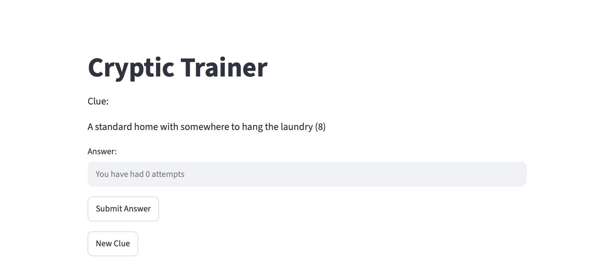

# Cryptic Trainer

LIVE v1.5 STREAMLIT LINK: https://cryptictrainer.streamlit.app

A full-stack cryptic crossword trainer with 10 clues. This app is designed to help players answer cryptic crossword clues. To do this, an AI Helper has been created that uses the socratic method to nudge the user in the right direction instead of simply giving them the answers.



## What it does

- **Loads clues from CSV:** given a csv file with cryptic crossword clues and answers in, the app loads these and presents them to the user as individual challenges
- **Streamlit Front End:** Simple streamlit front end that displays the clue, the letters in the answer and allows the user to take a guess.
- **AI Helper:** an LLM (currently gpt-oss-120b) designed to nudge the user towards the right answer if they are stuck, using the socratic method and explicitly told not to leak the answer or be too descriptive with how to arrive at the answer.

## Architecture

**Data model** - a normalised SQLite schema:

- `clues` - a database of all the clues, answers and how to get to the answers
<!-- - `attempts` - a database of all attempts logged by all users
- `users` - a database of the app users -->

**Flow:** ingest clues from csv -> present clues one at a time to the user -> user takes a guess <!--  -> attempt is logged for the user -->

## Tech stack

- **Python** - core logic
- **SQLite** - storage (via the `sqlite3` standard library)
- **pandas** - data transformation and aggregation
- **Streamlit** - dashboard / UI
- **Groq** - used to access the LLM with API key stored as streamlit secret

## How to run

```bash
# 1. Clone and enter the repo
git clone https://github.com/lewisjones1809-arch/cryptic-trainer
cd cryptic-trainer

# 2. Create and activate a virtual environment
python3 -m venv .venv
source .venv/bin/activate

# 3. Install dependencies
pip install -r requirements.txt

# 4. Run the dashboard
streamlit run Trainer.py
```

The app comes with the clues database as standard, but if for some reason the app errors on start saying there are no clues in the database, head to settings and import the clues.csv file from there.

<!-- ## Design decisions [WIP]

A few choices that reflect deliberate engineering rather than defaults:

- **Derived inventory over stored state:** holdings are recomputed from immutable purchase/sale logs, so the data can't silently corrupt and can always be rebuilt.
- **FIFO cost basis:** chosen over average cost because purchase prices vary by an order of magnitude, making average meaningless; verified against hand-calculated cases including multi-lot and out-of-order-date scenarios.
- **Variant detection from price data:** which finishes exist is inferred from which price families are present, rather than from a brittle rarity-based heuristic.
- **Swappable data source:** ingestion is isolated behind a thin layer, so the price/card provider can be changed without touching the rest of the app. -->

## Use of AI

Claude has been used to assist in this project a handful of times. These are listed below for complete transparency:

- **LLM implementation support** - I asked Claude to support with the implementation of the LLM into this app. This is done due to the fact that the goal of this project was to build a fun and useful app, and to test my ability to link a python backend into a Streamlit (eventually HTML/CSS) front-end in a user-friendly way and do user authentication. Due to the nature of having to fine tune LLM prompts and context, I decided this was not the most appropriate use of personal time for the desired learning and development outcomes I had for the project.
- **Migration to postgres check** - During the migration from sqlite3 to postgres, I asked Claude to ensure that I had successfully removed all dependence on sqlite3 and that my migration to postgres had been done correctly. It identified a couple of places I had missed which I subsequently corrected.

## Roadmap

**Working in v1.5:**
- Clue ingestion from csv
- Answer submission with correct/incorrect answers
- AI Helper

**In progress for v2:**
- [ ] More clues
- [ ] HTML/CSS front-end
- [ ] User and saved stats functionality
- [ ] Pick clues by difficulty and type
- [ ] Tailored training
- [ ] Improved AI Helper performance

## Notes

All clues have been written by me, any resemblance to other clues found online is purely coincidental.