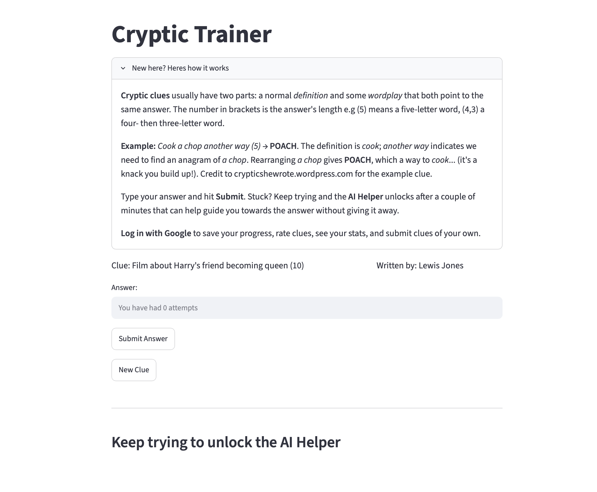
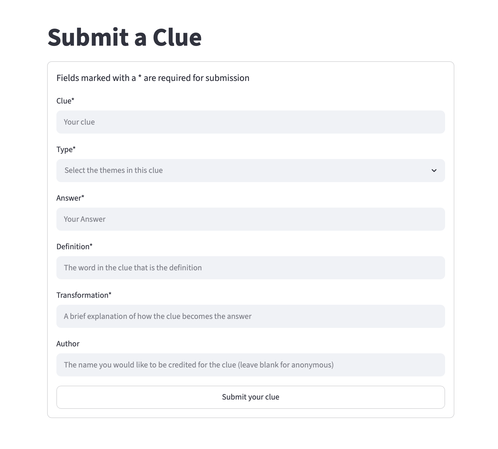
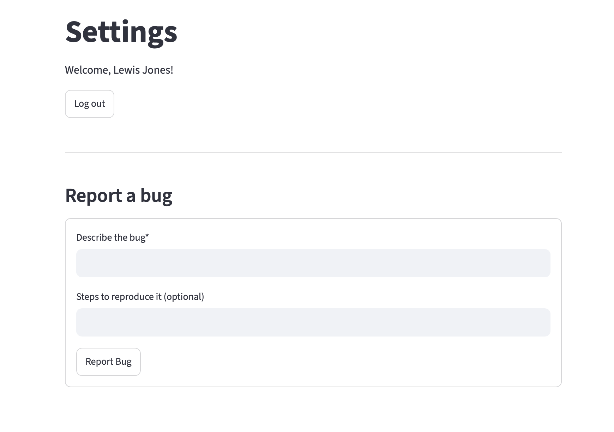

# Cryptic Trainer

LIVE v2 STREAMLIT LINK: https://cryptictrainer.streamlit.app

A full-stack cryptic crossword trainer with 10 clues. This app is designed to help players answer cryptic crossword clues. To do this, an AI Helper has been created that uses the socratic method to nudge the user in the right direction instead of simply giving them the answers.

## What it does

- **Loads clues from CSV:** given a csv file with cryptic crossword clues and answers in, the app loads these and presents them to the user as individual challenges
- **Streamlit Front End:** Simple streamlit front end that displays the clue, the letters in the answer and allows the user to take a guess.
- **AI Helper:** an LLM (currently gpt-oss-120b) designed to nudge the user towards the right answer if they are stuck, using the socratic method and explicitly told not to leak the answer or be too descriptive with how to arrive at the answer.
- **Google authenticated login:** authenticated login using a google OAuth client to enable per-user stat tracking and other functionality.
- **Crowdsourced clues:** to ensure that the variety and strength of clues is as good as it can be and not biased by my personal setting style.

## Architecture

**Data model** - a normalised SQLite schema:

- `clues` - a database of all the clues, answers and how to get to the answers
- `clue_tags` - a database that gives information about the types of each of the clues
- `attempts` - a database of all attempts logged by all users
- `users` - a database of the app users
- `submissions` - user submitted clues that can be reviewed and inserted into the main database
- `submission_tags` - as per clue_tags but for submissions
- `feedback` - a log of the star rating per clue as provided by users
- `bug_reports` - a log of all the user-reported bugs 

**Flow:** load clues into database -> present clues one at a time to the user -> user takes a guess -> attempt is logged for the user. If correct -> user is asked for feedback on the clue -> user is presented with another clue.

## Tech stack

- **Python** - core logic
- **Postgres** - storage via neon hosted postgres database
- **pandas** - data transformation and aggregation
- **Streamlit** - dashboard / UI
- **Groq** - used to access the LLM with API key stored as streamlit secret

The app comes with the clues database as standard, but if for some reason the app errors on start saying there are no clues in the database, head to settings and import the clues.csv file from there.

## Design decisions [WIP]

A few choices that reflect deliberate engineering rather than defaults:

- **User submitted clues:** actively crowdsourcing clues from the r/crosswords community to ensure a wide range of breadth of clue, and to enable me to focus more on the build and technical side.
- **Streamlit front-end initially:** to get a working version going and enable the clue database to be built up, a simple streamlit front end has been used with the goal of extending this to a HTML/CSS front end.

## Use of AI

Claude has been used to assist in this project a handful of times. These are listed below for complete transparency:

- **LLM implementation support** - I asked Claude to support with the implementation of the LLM into this app. This is done due to the fact that the goal of this project was to build a fun and useful app, and to test my ability to link a python backend into a Streamlit (eventually HTML/CSS) front-end in a user-friendly way and do user authentication. Due to the nature of having to fine tune LLM prompts and context, I decided this was not the most appropriate use of personal time for the desired learning and development outcomes I had for the project.
- **Migration to postgres check** - During the migration from sqlite3 to postgres, I asked Claude to ensure that I had successfully removed all dependence on sqlite3 and that my migration to postgres had been done correctly. It identified a couple of places I had missed which I subsequently corrected.
- **Support with caching** - I asked Claude on a number of occasions to ensure that I was storing variables correctly in the cache and to do full passes over my code to ensure that changes I had made would not cause breakages or issues with caching etc.

## Roadmap

**Working in v2:**
- Clue ingestion from csv
- Answer submission with correct/incorrect answers
- AI Helper
- User and saved stats functionality
- Bug reporting
- Clue feedback system
- Clue submission and review system

**Planned for v3**
- [ ] HTML/CSS front-end
- [ ] Pick clues by difficulty and type
- [ ] Tailored training
- [ ] Improved AI Helper performance

## Notes

All clues have been written by me or crowdsourced from users of the app, any resemblance to other clues found online is purely coincidental. Any infringement of copyright or intellectual property from clues submitted by users of the app is unintentional, and if there is any infringement please contact me directly and I shall remove the offending clues.